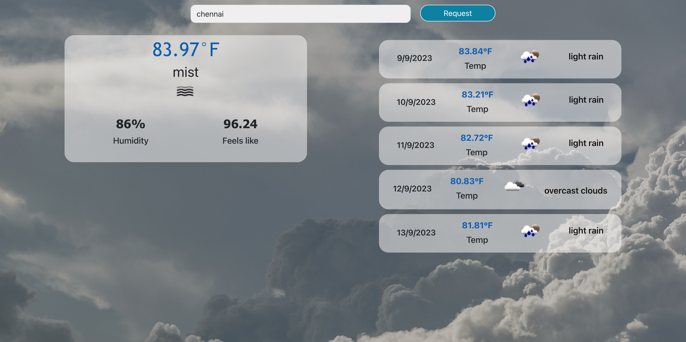

# Front end for Weather app using ReactJs

To run the code
1) clone or download zip
2) npm install
3) npm start

## Link to the deployed app : (https://64fc902c2ec0d97420cd030a--dainty-rolypoly-70d5a8.netlify.app/)

 
